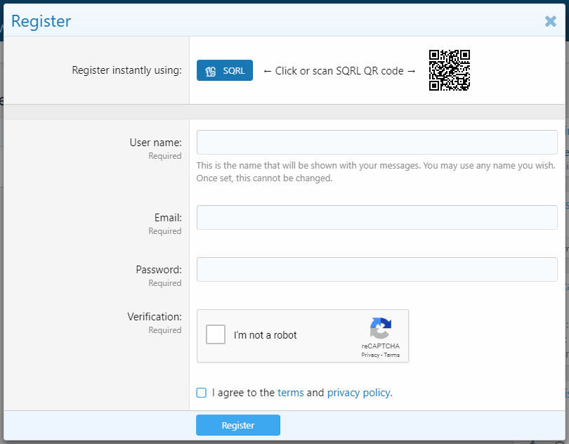

# SQRL for XenForo

This add-on adds SQRL authentication to XenForo 2.0. You can read more about SQRL from [Gibson Research Corporation](https://www.grc.com/sqrl/sqrl.htm).

## Features

- Register/login with SQRL
- Toggle requirement of email on registration
- Provides altered password and email change dialogs to accommodate users without either
- Displays error if browser has scripting disabled
- Displays error if communication with SSP server fails
- Allows removal of email and password from account page at any time

## Requirements

- XenForo 2.0 using HTTPS
- PHP cURL extension [http://php.net/manual/en/book.curl.php]
- SSP server on the domain of the web server or a subdomain

## Install

- Upload everything inside `upload/` to the root of your XenForo install
- Navigate to the Admin CP -> Add-ons and click 'Install' on SQRL
- On the server hosting the SSP server, open `regedit.exe` and navigate to `Computer\HKEY_LOCAL_MACHINE\SOFTWARE\WOW6432Node\Gibson Research\SqrlApi`
- Set `WebServerAuthURL` to this value `https://your-xenforo-install.com/the/xf/path/?sqrl/authenticate/&token=%s`
- Go to Setup -> Connected accounts -> SQRL
- Enter the hostname of the SSP server (as seen from the web browser's perspective)
- Enter the hostname and private port of the SSP server (as seen from the web server's perspective)
- Save
- Go to Setup -> Options -> SQRL 
- Show your dedication to SQRL by ticking all the checkboxes
- Save

## Uninstall

- Navigate to Admin CP -> Add-ons and click 'Uninstall' on SQRL
- Delete these items
    - `js/sqrl.js`
    - `js/sqrl.min.js`
    - `styles/default/sqrl`
    - `src/addons/Sqrl`
- Run this query in the database to delete all the identity tokens:
    - `DELETE FROM xf_user_connected_account WHERE provider = 'sqrl'`

You will also need to remove them from the SSP server which is not done automatically.

## Release notes

### 1.2.0

- Add remove password button.
- Add email removal button.
- Add options to specify the level of SQRL-centricness.
- Display 'You cannot remove your last connected account without setting up either an email or a password.' error when trying to remove last associated account with no password and email.
- Suppress an exception thrown when trying to notify the user via email that his password was changed if the user has no email.
- Fix bug where SQRL validation prompt highlights wrong sidebar item on account pages.

### 1.1.5

- Update template modifications to work with XF 2.1.

### 1.1.4

- Add setup step that re-persists all SQRL IDs.
- Make the QR code clickable.
- Make the SSP server aware that we are in fact assocating and disassociating users so it retains the SQRL ids.

### 1.1.3

- Suppress QR code auth check when page is not visible.
- Move SQRL to top of account/connected-accounts page.
- Suppress ajax animation on pag.sqrl requests.

### 1.1.2

- Reduce delay between /pag.sqrl requests to 500ms from 3000ms.

### 1.1.1

- Fix bug where /pag.sqrl URL is malformed.

### 1.1.0

- Add support for slot ID.
- Add nut to QR image ajax request.
- Improve error when verifying identity with different SQRL ID.
- Add message when requiring identity verification and improve style.
- Fix IE11 incompatibility.
- Fix bug where user logged in as the first user to ever authenticate *facepalm*.
